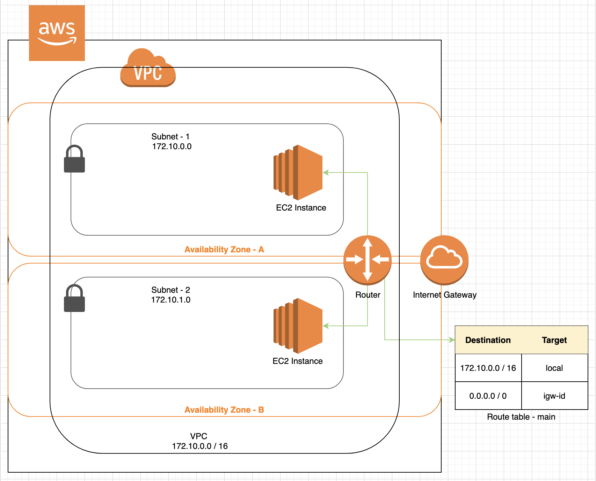

_In the previous post we looked at VPC. In this post we will take a closer look at the various elements of VPC._.

## Elements of VPC

Here is the list of important elements that are part of the VPC. 
- Subnet 
- Route Table 
- Router 
- Internet Gateway 
- CIDR Block 

### VPC Layout with its elements.

 

### Subnet
Subnets are like a child network inside of your VPC. It is in this Subnet that you launch your AWS resources like EC2 Instances. Per AWS, it is a range of IP Addresses in your VPC. Subnets also have their own CIDR Blocks, but these CIDR Blocks are a subset of the VPC's CIDR Block. There are two types of Subnets - **Public Subnet** and **Private Subnet**. 
- Public Subnet is one to which traffic from internet can reach into. 
- Private Subnet is one to which traffic from internet cannot reach into. 

### Route Table
It is a table that maintains a set of rules, called routes, that are used to determine where the network traffic is directed. By default a VPC gets one **Route Table** called **main**. Subnet is implicitly associated with the main route table. Route tables can be associated with an internet gateway or a virtual private gateway. Each route in a Route Table specifies a destination and a target. For example, to enable your subnet to access the internet through an internet gateway, you would add destination - 0.0.0.0/0 and target - igw_id. Every Route table contains a local route for communication within the VPC.  

### Router
A router is responsible for passing request or information packets from one server to another. It makes use of destination IP Address to route the packet of information or request. Router is invisible for most purposes inside of VPC. Only way to control router is Route table. Router manages all the local communication inside the VPC.

### Internet Gateway
It is a device attached with your VPC. It enables communication between resources in your VPC and the internet. It is highly available and reliable device. It is redundant and horizontally scaled. 

### CIDR Block
CIDR stands for Classless Inter-Domain Routing. It is an internet protocol address allocation and route aggregation methodology. In simple terms, it is a range of IP addresses that is used for assigning IP address to a node inside a subnet. 

For example, a CIDR value of 10.0.1.0/24 means that 10.0.1 is the Network ID, .0 is the Host ID and 24 is Network Mask. With the example of 10.0.1.0/24 we can have a total of 255 hosts. So we get the range for IP address inside the subnet as - 10.0.1.0 to 10.0.1.254
 

### Things to remember 
- Subnet is logically mapped to an availability Zone.
- Best practise is to put one Subnet in one availability zone and another Subnet in another availability zone to act as a fallback incase of availability zone failure. 
- You would host Web Server on a Public Subnet.
- You would host Database Server on a Private Subnet. 
- You can explicitly associate a subnet with a particular route table. 
- A Subnet can only be associated with one Route Table at a time. 
- You can associate multiple Subnets to same Route Table. 
- The main route table controls the routing for all subnets that are not explicitly associated with any other route table. 
- You cannot delete the main route table. 
- You can explicitly associate a subnet with the main route table. 
- There is no additional charge for having an internet gateway in your account. 
- You can detach an internet gateway from VPC and delete it.
- You cannot detach an internet gateway if your VPC has resources with associated public IP Address or Elastic IP. 
- A CIDR block helps us identify the Network ID and also tells us how many Hosts we can have in that network.
- Every server inside a subnet will have same Network ID but different Host ID.

